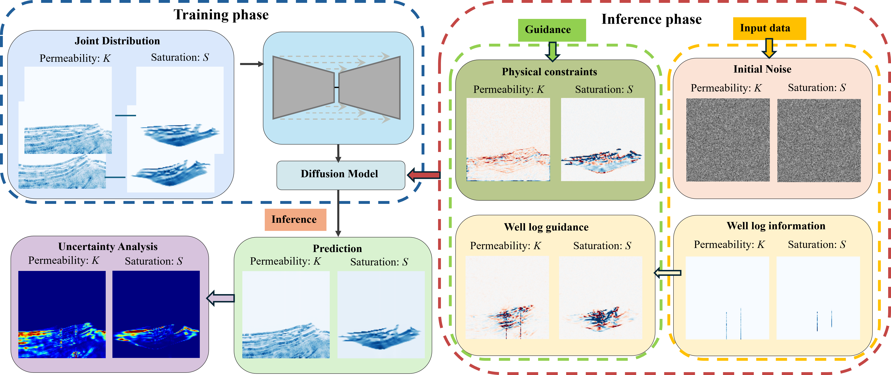
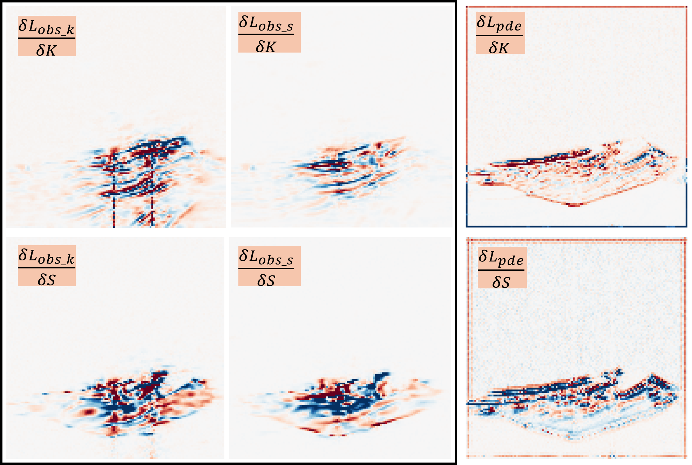
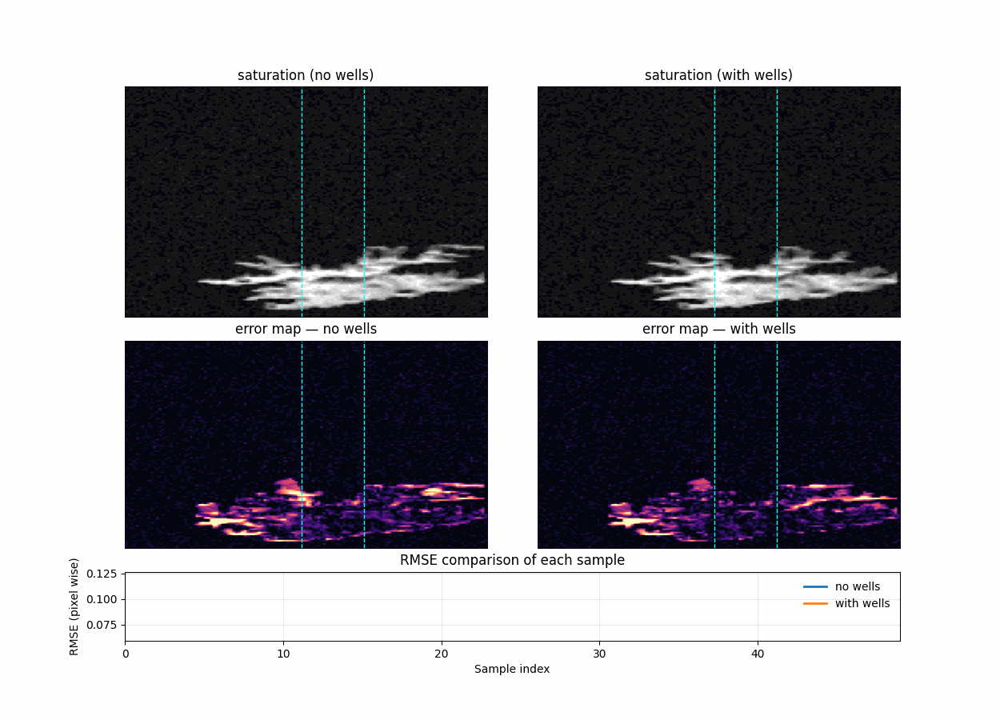
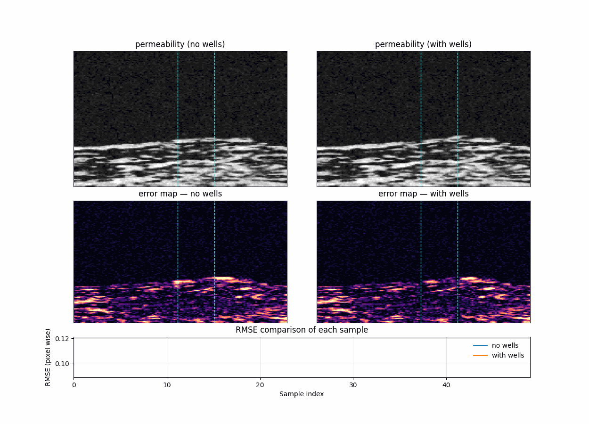

# Physical information guided diffusion models

Official PyTorch implementation <br>  
Reconstructing reservoir states from multimodal data via score-based generative models<br> 
This code is developed based on the paper  [Shiqin Zeng, Haoyun Li, Abhinav Prakash Gahlot, Felix J. Herrmann. “Well2Flow: Reconstruction of reservoir states from sparse wells using score-based generative models.”](https://arxiv.org/abs/2504.06305) <be>
<br>
Below is the workflow diagram illustrating the training and inference process:



## Requirements

Python libraries: See [environment.yml](environment.yml) for library dependencies. The conda environment can be set up using these commands:

```bash
conda env create -f environment.yml
conda activate DiffusionPDE_seismic

```

## Physical guided information and well log data guidance



## Forward modeling generated samples



## Inverse modeling generated samples


